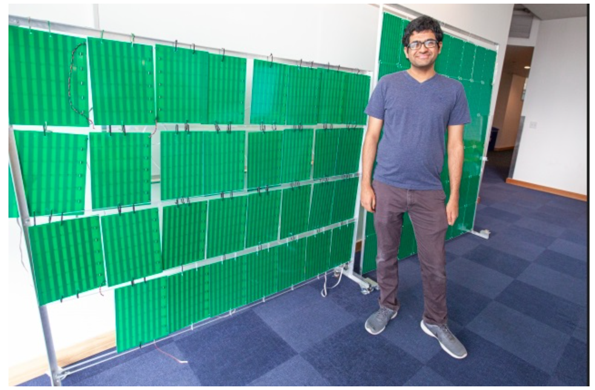

# 问辩题库V3.0 2021/5/13

---

## 技术类

---

* ### 创新点——大型单板超表面

1. 大型单板的设计的创新性主要体现在什么方面？
	
	>主要增强了智能超表面的可调控性和降低其部署难度。研究表明，智能超表面的增益基本与单元个数（面积）成正比，单元数少就导致了性能和方向精度较差。目前已有的超表面单元数较少，少有的大型超表面也是由多块PCB构成，协同调控难度较大，实际难以部署。而我们设计了一款 1100 个单元的单板大型超表面，调控方向达160°，同时采用分组调控算法，实现了性能和调控能力的双重兼顾。

2. 超表面面积太小会带来什么影响？

	>可调控性和性能较差。接收面积小，收集到的电磁波信号能量较低；同时控制信号路数太少无法完成波束赋形，或者导致波束指向性不高，能量不够集中。

3. 大型超表面的技术门槛在哪里？

	>从设计的角度，大型超表面需要大量控制信号，对控制电路的走线布局、信号完整性等提出很高的设计要求。我们团队成员耗时半年多设计了这块四层电路板、并经历多次制板返工才获得成品。
	>
	>从调控的角度，我们开创性的提出了基于移位寄存器的串并转换控制架构，可以大量减少所需控制IO口的数量，使大型单板超表面的调控具备可行性。

4. 世界上是否有更大的超表面，该产品处于国际什么水平？
 
	>目前麻省理工学院的智能超表面是几乎覆盖了一面墙壁（由3000个单元构成），但缺乏自适应的智能调控，他们通过人工的调节，可以将平均信号强度提高近10倍。
	>
	>而我们的智能超表面产品在室外50米测试中能将接收信号功率增强500倍，这在国际上处于领先水平。
	>
	>

5. 超表面改变反射方向的原理是什么？

	>每个单元可以等效为一个天线，对反射信号的相位响应可调，整个超表面等效为天线阵列实现波束赋形，产生可调控的指向性波束。所以h*  
	>
	>

* ### 创新点——控制电路

1. 控制电路的性能优越体现在什么方面呢？

	>一方面采用基于移位寄存器的串并转换控制架构，有效减少所需控制IO口的数量，为采用低端单片机主控方案提供可行性，才能将整体成本降下来。
	>
	>另一方面负压产生电路支持更宽的动态电压调节范围，才能够支持超表面单元的相位响应需求。整体上，控制电路的功耗极低，在1W以内。

2. 除了现有的控制架构，还有其他控制方案吗，是否有其他课题组提出过？

	>其他课题组如东南大学团队没有公开他们的控制方案，但他们主要将智能超表面应用于调制信号产生上，只用到两路控制信号。
	>
	>我们还提出了基于行列扫描和锁存器的两种控制架构，马上将应用到我们新的毫米波段的超表面板上，这也是我们的独创专利成果。

* ### 创新点——反射系数优化算法

1. 与其他算法相比最大的优势或者说创新性体现在什么地方？

	>目前已有的反射系数优化算法大多还是基于无线信道信息实现的。但与传统的MIMO技术不同，智能超表面缺乏射频链路，不具备对信道信息的获取能力，无法直接应用现有的基于导频的信道估计。学术界已知的绝大部分反射系数计算方法复杂度太高，实际应用难度过大，得出的性能提升结论也只是通过仿真结果验证，未在实际系统中做过测试。
	>
	>我们提出了基于反馈、定位、宽窄波束联合扫描，三种无需获取信道信息的高性能、低开销的实用算法，并在原型样机中进行了实测验证，证明了这些算法的优越性。

2. 目前算法扫描的速度如何，是否具备实用性？

	>算法的复杂度为O(n)，n为超表面分组数，开销极低。目前支持室内低速移动场景下的信号覆盖增强，但受限于无线空口吞吐率，尚不支持高速移动场景，我们正在自主研发一套空口反馈设备。（其实目前5G对于移动场景的支持也存在明显缺陷）。

* ### 超表面原理、硬件、材料

1. 技术壁垒多高，他人仿制的难度有多大？

2. 看你们只说有相位响应，没提到幅度相应，结果却说能够汇聚【增强】信号，那信号经过智能反射面后除了改变相位之外，信号【幅度】会变大吗？为什么？

3. 智能超表面越大越好，还是尺寸越小越好？
	
	>要辩证的看待这个问题，不同使用场景有着不同的尺寸要求。

4. 小小的反射单元材料为何能改变信号的相位？这个过程在物理上是怎么实现的？

5. 为什么超表面单元在不同电压下有不同的相位响应？

6. 你们的主控模块采用的是哪种芯片呢？为什么低端芯片就能实现复杂控制逻辑呢？

7. 超表面改变波束反射角度的时延是多少？

8.	为什么智能超表面能够灵活改变信号反射的方向？

	>我们的智能超表面有1100个单元，每个单元在电压控制信号的作用下对信号产生一个反射相位响应，超表面整体等效为一个天线阵列能够实现信号的波束赋形，也就是把波束达到我们需要的位置（简单的理解，每个单元看做一条径，每一条径的信号有不同的延迟，我们就是通过波束赋形技术，使得每一条径相干叠加后信号最强而不是被抵消。）

9. 具体介绍一下你们超表面单元，怎么设计出来的？

* ### 测试

1. 你们是如何对超表面进行室外测试的？如何保证测试结果的可靠性？

2. 相比于你们的500米户外测试，业界有没有其他远距离传输的例子？最远能传多远？

3.	你们室内外测试具体怎么做的？

* ### 软件

1. 软件采用了什么控制算法？

2. 使用过程是否有延时？

3. 你们超表面现在算法智能到什么程度，可以做到秒以内的响应延迟吗？

* ### 使用

1. 你们测试时发送端和接收端都是处于静止的情况下吗？但实际的移动通信中收发机是有着相对运动的，此时信道的变化会更加快，怎么证明你们的产品能够很好地适用于移动通信呢？

2. 你们的产品适用于何种场景中？

3. 解释一下智能超表面工作的具体过程？

4. 反射后的信号会有功率衰减吗？如果有的话是多大？

5. 不同使用环境（比如说车库、城市中、矿洞）下用户的信号接收功率有什么区别？

6. 超表面的放置高度有什么要求？

7. 超表面用于室内时大小多大合适？用于室外时大小多大合适？

8. 你们的产品要发挥良好的性能需要多大的面积呢？会不会很占地方？

	>实际上我们发现，目前这一版超表面为0.3米宽，0.8米高，实际上做成一半大小也能发挥十分优良的性能，我们用金属挡住一半超表面仍有两百多倍的信号功率增益。做个更明显的对比，华为专家在与我们交流的过程中对我们的成果十分满意，他们说他们在不改变发射功率通过软件算法提升6dB(也就是两倍)就已经是非常大的突破了。因为我们知道Wi-Fi路由器是有最大发射功率的限制的。所以基本上做成装饰画的大小就能实现非常优越的性能。

9.	你们这个能穿几堵墙，能否支持不同楼层之间的信号增强。

	>经过我们测试，经过两堵墙体的衰减，超表面仍然具有很好的信号增强性能。隔楼层之间的通信也完全没有问题。

10.	目前中国5G技术采取的是sub-6G频段衰减问题有多突出呢，因为现在还未到毫米波频段。

	>根据“Understanding Operational 5G”这篇论文，在相同的布站密度下，sub-6G频段的5G技术的覆盖漏洞（RSRP在-105dB以下）是4G的两倍多，由此可见5G覆盖差是一个亟待解决的问题，而我们的智能超表面可以辅助覆盖增强，而一旦后面进入毫米波时代，我们的智能超表面只需修改超材料的结构参数就可继续用于通信网络的覆盖增强。

11. 使用产品是会不会带来很强的电磁辐射？

12.	产品对使用环境有什么要求？

13. 引入你们的产品后，能确保用户在所有地方都能稳定、流畅地使用网络吗？

14. 在实际应用中，有多基站，有多用户，甚至存在着其他超表面反射的电磁波，你们该如何做到这么复杂的环境下也能正常使用呢？

* ### 稳定性

1. 该产品工作的过程中是否可能会出现故障？出现故障的可能原因有哪些？

* ### 竞品

1. 相比其他同类产品你们的优势是什么？

	>其实严格意义上说，目前并没有做信道优化和信号增强的相关超表面竞争产品。相比于传统的信号增强设备，如直放站、中继等，我们的产品有明显的成本和功耗优势（成本以百元测算，无源反射功耗在1W以内）。相比于其他超表面技术，麻省理工学院的RFocus没有自适应调控功能，人工调控，我们的产品的接收信号功率增益效果是他们的50倍。

2. 现在市面上有没有同类的竞争产品？

	>没有，目前并没有做信道优化和信号增强的相关竞争产品。如果非要说超表面产品，那东南大学的崔铁军院士团队也在做超表面的研究，但他们是把超表面做成一个信号源，用来产生PSK、QAM等调制信号，和我们的应用场景——中继节点完全不同。而且他们的系统并没有使用那么多路控制信号，整个超表面基本分为两路或者四路控制，而我们的超表面有1100个单元，需要更为复杂的控制电路和控制算法。

3. 解决5G覆盖盲区除了超表面外有没有其他技术路径？你们超表面方案的优势在哪？

4. 为什么系统的性能超越麻省理工学院那么多？

	>最重要的原因是麻省理工学院的超表面没有采用高性能的控制电路和自适应的系数优化算法。他们将多块超表面部署在墙上，人为的控制其反射系数，效率和性能较低。而我们采用了自研的控制电路和低开销的自适应算法，能够达到比他们更好的效果。

5. 你们做的这个系统和清华团队的研究成果有什么不同、创新点或优化的地方吗？

	>清华大学团队是想用智能超表面替代相控阵天线阵列，本质上是在做基站的射频前端，而不是我们的中继节点路线。他们将发射天线与超表面固定在一起，是起到一个选择信道而不是优化信道的作用。成本和能耗方面我们也更具优势，他们的超表面功率达到153W，而我们只有不到1W。

6.	目前Wi-fi单个AP就几十块钱，你们产品还有什么优势?

	>一是现在好点的Wi-Fi路由器产品其实普遍在两百元左右，我们的产品每个变容二极管只要几分钱的成本，低端32单片机芯片只要十元左右，量产后还是具备一定的成本优势的；二是我们的产品功耗极低，目前一个Wi-Fi路由器普遍几十瓦的功率；三是我们的产品没有射频链路，不产生额外的电磁波辐射，只做信号的反射增强，更符合用户追求健康生活的理念；而且我们主要瞄准的还是5G通信这一块更大的市场蛋糕。

7. 我了解到行业内已经有北京行晟科技有限公司等在生产智能反射阵，你们的产品和他们比有哪些优势，打算如何抗衡？

* ### 挑战

1. 作品的技术难度在哪？

	>主要有三点：大型智能超表面的设计、控制电路的架构、反射系数优化算法。

2. 在研究过程中最大的挑战是什么？

	>是超材料反射单元的结构设计，超材料单元的本质就是金属、介质和可调元器件的结合。但金属铜片的形状，尺寸，分布这一系列参数都是需要不断试错、调整的过程。我们花了近一年的时间，先在CST上做了大量仿真工作，随后在微波暗室中做了大量测试（测试实际的电压-相位响应曲线），最终成型的超材料单元结构。

3. 你们做的产品用到的主控，我看是Zynq-7，依旧是依赖进口吧。你们在未来对这部分有什么想法？

* ### 部署

1. 实际部署的可行性有多高？场地、调试、维护等的成本如何？实际应用情景下需要多少块超表面联合使用、如何选址才能真正消除覆盖盲区？

2. 对于一个普通大小的小区，若要达到信号全覆盖，需要部署多少个超表面？

3. 室外环境恶劣，产品能否实际部署？

	>只需要配置塑料保护罩，该材质并不会对电磁波造成衰减影响产品性能。现在的基站，中继也是以这种形式暴露在室外环境下。

---

## 文字材料类

---

* ### PPT

1. 5G为什么会覆盖能力差？

2. 现有5G基站的能耗和覆盖范围是什么情况？

3. 超表面单元的调控性强体现在什么地方？（不是指整个板子，而是PPT上标出来的单个单元。）

4. 你们这里说的超表面方向性集中有什么数据指标来支撑吗？

5. 可以简要介绍一下你们的自适应反射系数优化算法吗？（这一页PPT停留时间比较短应该来不及看流程框图）

* ### 企业

1. 目前与企业有哪些应用与合作？进行到什么阶段？

2. 你们说现在跟华为在谈合作，谈到了哪一步了呀？

	>由于我们的系统是三月公布的，各路媒体报道也是集中在最近这段时间，可以看到华为的专家也是相当快的注意到了我们的成果多次来访，目前就还在和他们洽谈中。

3. 是如何和企业进行联系的？

4. 各企业对项目的评价如何？

5. 华为作为通信设备的龙头企业，产品是否能满足需求？

* ### 论文

1. 论文为什么是已投稿状态？
   
	>刚写完，有加拿大院士认可。

2. 加拿大院士引用来做什么，说明什么具体问题？

3. 论文现在收到审稿意见了吗？

4. 怎么看出加拿大工程院院士对你们的系统表示认可？

	>在他的论文中，对我们的文章的引用次序为第三篇，并且评价我们的系统单个反射单元功耗不到1毫瓦,在绿色通信领域大有可为；同时是一种很有前途的多RIS无线信道优化方案。

* ### 专利

1. 是否每个创新点都有对应专利支撑？

	>是的。超材料方面，有一个“一种毫米波的智能超表面单元”的专利成果。控制架构方面，有“一种基于移位寄存器的智能超表面控制系统 ”，“一种地址总线式的智能超表面单元控制方法”，“一种基于锁存器的有源矩阵式智能超表面单元控制方法”等专利。

2. 专利发表时间为什么比较集中？

	>因为我们项目需要的技术积淀很长，各个创新点都有关系，都是整个大系统的一部分，基本是等原型系统搭建完成才开始准备专利材料，所以发表时间比较集中。

3. 几项专利与项目是否相关？

4. 是否有国际专利？

5. 专利申请人为何全部是学校？

6. 是否有相似的文献或者专利？产品创新点在哪里？

* ### 科技查新

1. 报告中的查新是国内查新还是国际查新？查新评价是什么？

	>国内查新，评价：国内外未见同类报道。

* ### 专家推荐

1. 如何联系的推荐专家？

2. 推荐专家有无亲自看过？

3. 专家的领域与项目是否相关？

4. 为什么你们的项目没有院士推荐呢？

* ### 其他材料问题

---

## 产品类

---

* ### 经济

1. 该产品的使用寿命如何？能否长期使用？

2. 单件产品成本是多少？**受众**是否用得起？

3. 产品如何定价？利润如何？

4. 准备采用怎样的营销策略和营销模式？

5. 创业项目有完善的商业计划书吗？商业模式和盈利模式是否有设想，具体如何？

* ### 成本与市场

1. 产品成本是多少，怎么测算的？

	>我们这个智能超表面的成本约为一百元左右，是根据物料的批量价格和面板的生产成本测算的，没有考虑研发投入。

2. 如何降低成本，如何进行成本控制？

3. 项目继续优化后，成本还能再降低吗？
 
4. 如何推向市场？批量生产的可行性如何？

5. 你们的这个产品具体能减少多少基站数量呢，这个5000亿的市场规模是怎么估出来的？预估市场的具体依据在哪里，有没有数据支撑？

	>根据vivo通信研究院发布的《RIS初步系统仿真结果和研究建议》中指出，1000米的基站间距配合两个RIS产品，该方案性能优于500米的站间距部署方案。也就是说，本作品形成的产品可以替代5G室外小基站的功能。中国电信科技委主任韦乐平预计中国市场 5G 小基站数量可达千万级，而5G室外小基站的设备采购价格约为 20000 元/套，综合测算我们的产品具有5000亿左右的市场规模。

6. 投入市场的话需要多少年？

7. 如果打算推向市场，是打算从室内入手还是室外入手？

8.	制造产品所用的主要材料？

9.	所选材料上有什么创新？

10.	是否存在国外垄断材料或技术？有没有被“卡脖子”的地方？

11. 产品面向的对象是那些？

12. 目前的市场空间如何，怎么市场化？

	>两个产业化方案，一是5G盲区覆盖增强，该场景下障碍物遮挡了无线信号，使信号强度大大减弱，我们可以在广告牌、显示屏、建筑外表面上等部署超表面材料，使得信号覆盖范围更大，用户吞吐率更高，连接稳定性更强。保守估计，该市场达到5000亿以上的规模。第二个产品化路线是室内场景下Wi-Fi信号的覆盖增强，对于非直射径的信号，超表面可以为其找到最佳的反射路径，并对信号汇聚增强，从而实现稳定传输。该市场规模预计为1000亿。我们提出了将超表面与装饰画合二为一的产品概念，可以完美地将科技与艺术融合在一起 。

13. 你们在市场开拓、产品推介方面有哪些可以调动的社会资源？

14. 你们的产品能否迅速扩张，抢占市场，取得一定的市场地位？

* ### 批量化与商用

1. 这个东西有商用计划吗，多久能商用，投入商用的主要困难在哪？

2. 最后的成品准备做成什么样？

3.	目前产品化产业化是做到了哪一步？

	>目前我们已经在着手推进产品原型实现，但由于系统成型较晚，相关工作还在筹备当中。老师追问：相当于还没做产品？我们已经联系了一个产品设计的同学在做外形设计，然后超表面系统本身也在进行相关的优化使其符合产品化的要求。

4. 产品批量生产的可行性如何？

5. 是否有成立初创公司，进行产品化研究？

6. 产品化的道路上，准备如何整合资源呢？

7. 产品是否有明显的规模效应？

8. 智能超表面行业竞争是否激烈？行业资源的变化（买方缺失、供应商提价、替代品出现、强有力的新入局者、行业内的竞争者）对你们产品化的影响大不大？你们还有竞争力吗？打算如何做？

* ### 政治

---

## 其他类

---

* ### 名词解释

1. 这个“超”是什么意思？

2. “超材料”是什么样的材料的呢？如何确定采用这种材料的呢？
   
3. 智能超表面这个“智能”体现在什么方面——采用了什么人工智能的算法还是？

	>不是的，智能体现在自适应的波束成型功能上，无需人工干预可以自行将波束对准用户所在的位置。像我们提到的麻省理工学院的超表面产品，他们就是人为的调节控制电压，得到了一个不甚理想的信号增益效果。

* ### 意义

1. 用【**一句话**】讲清楚你们团队这次设计实现的功能？

2.	怎么肯定这个系统还能用于6G技术？

	>因为在第一版6G白皮书中，太赫兹通信已经被纳入6G通信的潜在关键技术，而智能超表面其实早在20世纪就已经应用于毫米波、太赫兹等高频波段的军用雷达设备中，因此顺理成章的成为了6G系统的潜在关键技术之一。

* ### 目标

1. 下一步优化的目标？
	>一是提高反馈机制的速度；二是开发支持更多频段的超材料单元。

2. 这个项目做到最终你们想实现的伟大愿景是？

* ### 缺点与局限性

1. 目前作品存在的局限性？

	>局限性主要体现在当前采取的反馈机制为无线串口反馈，吞吐率较低。我们正在自主研发高速无线空口反馈方案，采用AD9361高速射频前端，逼近算法和超表面硬件的调控极限速率。

2. 现在还有哪些想解决却还没解决的问题？

3. 现在为什么还做不了多用户？难点在哪？

4. 你们的产品后续还有哪些改进方向？离真正投入实用还有多少差距？

5. 怎样解决用户移动情况下的波束跟踪？

6. 怎么支持多用户的问题？

	>一是使用多波束赋形技术，产生多个指向性波束为多个用户服务。而是采用时分的方式，划分成时隙资源为用户提供服务。

* ### 资金

1.	是否有资金资助？

	>无国家资金资助，是我们课外兴趣的项目。

2. 研究资金来源是什么？

3.	专利、论文等资金来源是什么？

	>老师的资金支持。

4. 批量试生产需要多大投资规模？

5. 产品化的道路上，你们是否有广阔的融资渠道？是否有找到天使轮融资或风险资本的青睐？

* ### 创意

1. Idea是怎么想到的？

2. 注意到你们团队成立到产品原型搭建成功之间经历了一年多时间，你们是如何确定这个原型的？中间经历了哪些困难呢？

3. 提出控制电路中采用移位寄存器方案的灵感来自哪里？

* ### 独立性

1. 指导老师尹老师在这次的项目中扮演着一个什么样的角色？为你们提供了哪些帮助？在团队中发挥了多大的作用？

2. 团队成员是如何分工的？

3. 这个系统是你们自己做的吗，还是老师学长学姐代做的？

	>这个系统我们团队成员从2019年就开始做，是老师给了智能超表面这个课题方向，我们自己设计了超材料结构，控制电路以及相应的反射系数优化算法，中间也经历了很多困难和迷茫的时候，比如这块超表面板就是经过了三次失败最终才做出来这么好的性能指标的。

4. 何时开始着手进行设计？研究周期大概多久？

	>大三进入实验室开始接触，学习和积淀，大四开始进行对成果的转化等。

5. 团队如何分工？各成员有什么贡献？

6. 团队是如何建立的？

7. 是否是实验室项目？

8. 师兄是否有类似的工作？

9. 作品中哪些是自主设计的？哪些是现有成品？

10.	你们几个本科生的工作量体现在哪里？

